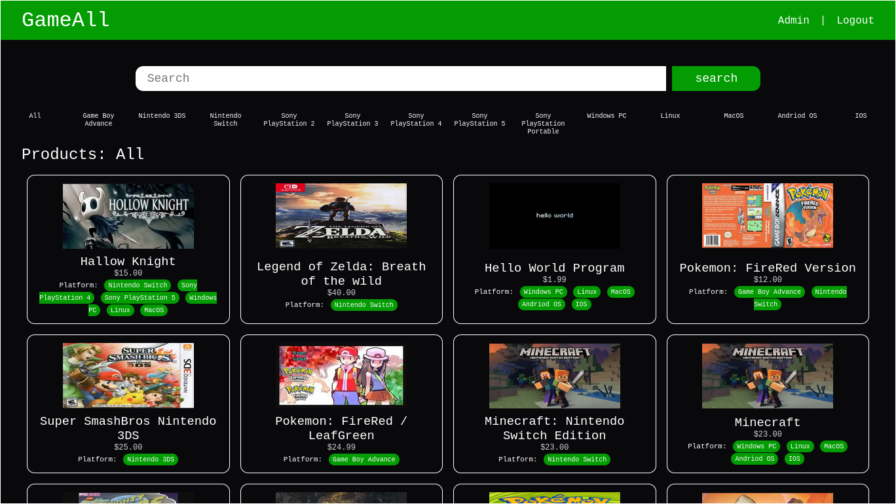
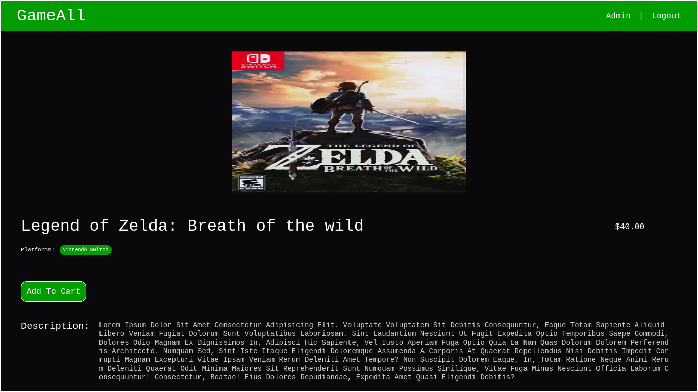
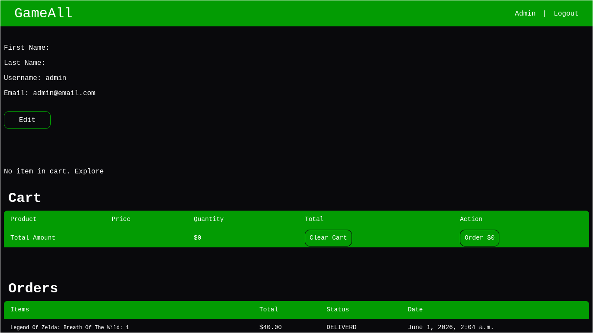

# GameAll E-Commerce Game App
A simple e-commerce app that mainly focuses on selling game complete with both frontend and backend 
and built to minic how a realworld e-commerce platform works in some ways.





## Core Features
- Admin Panel: made use of the django admin panel for managing Product, Order, Cart and more.
- Products: anyone can view the products but have to be logged in to add an item to cart.
- Dashboard: you have your dashboard for managing your cart item and viewing your orders.

**NOTE**: **Payment** is not yet implemented because of some issues but would be later on.

## Tech Stack
- Frontend: HTML, CSS, JavaScript
- Backend: Python, Django
- Database: sqlite3

## Getting Started
To install and run this project on your local machine.

### Prerequisites
- Python
- pip

### Installation
1. Clone the repository and cd into it
```sh
git clone <this repo url>

cd game_all_django
```
2. Set up a virtual env
```sh
python -m venv .venv

# for Windows(CMD)
.venv\Scripts\activate.bat

# for Windows(Powershell)
.venv\Scripts\activate.ps1

# for macOS and linux
source .venv/bin/activate
```
3. Install dependencies
```sh
pip install -r requirements.txt
```
4. apply migrations
```sh
python manage.py makemigrations
python manage.py migrate
```
5. Create Superuser/Admin for admin/adding products
```sh
python manage.py createsuperuser
```
5. Run the app
```sh
python manage.py runserver
```

## Contributing
Contributions are a great thing, maybe you found a bug, something that needs to be changed, a hobby or for your first badge your contributions are highly apprteated so feel free to contribute.
1. Fork the project
2. Create your Feature branch (git checkout -b <branch name\>)
3. Make your changes and commit them (git commit -m "Added a cool feature")
4. Push to the Branch (git push origin <branch name\>)
5. Open a Pull Request
